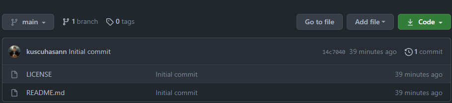

# Kodluyoruz/Patika Ilk Repo
Kodluyoruz/Patika Eğitimi kapsamında açtığım ilk repo

Bu repo [Kodluyoruz](https://www.kodluyoruz.org) Git eğitiminde oluşturduğumuz ilk repo. İçerisinde bir adat readme.md ve index.html barındırıyor.



## Installation
Öncelikle projeyi klonlayın.
`git clone https://github.com/kuscuhasann/kodluyoruzilkrepo `

## Usage
Projeyi klonladıktan sonra Visual Studio Code programını açınız.

Windows için:
```windows
cd kodluyoruzilkrepo
code .
```

## Contributing
Pull requestler kabul edilir. Büyük değişiklikler için, lütfen önce neyi değiştirmek istediğinizi tartışmak için bir konu açınız.

## License
[MIT](https://choosealicense.com/licenses/mit/)

